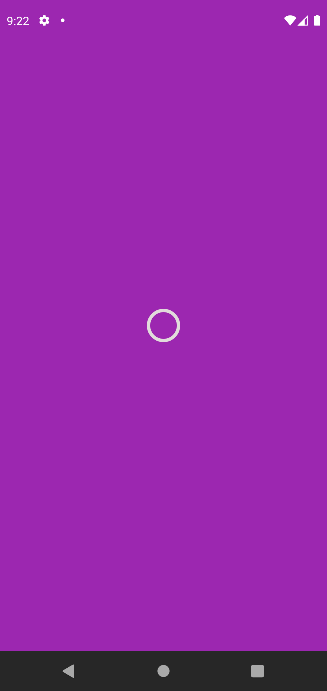
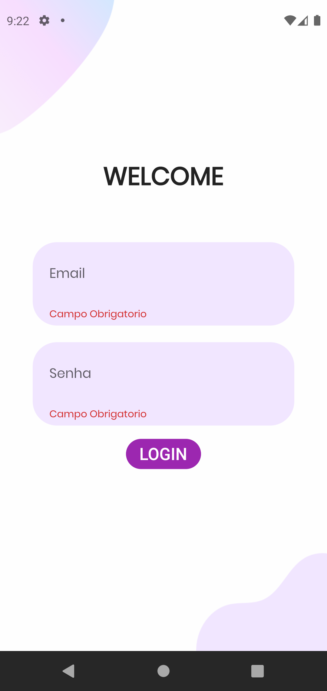
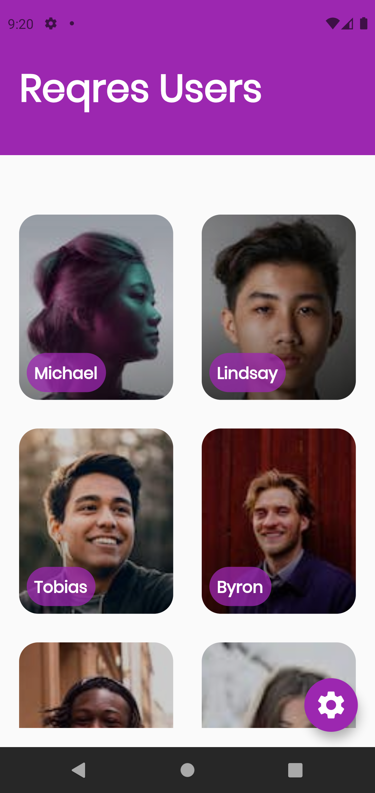
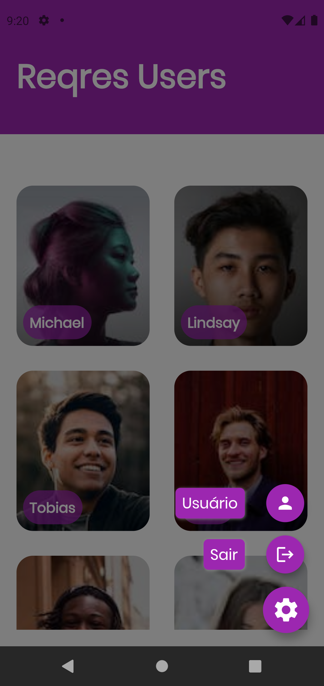

<h1 align="center">
	  
    Reqres App - Reqres Api
</h1>

    

        <em>
            Flutter application to get and post data on Reqres API  
        </em>
    
     
    
    
   
     
    
     
     
   
    

## 📌About

Flutter application to get and post data on Reqres API [Reqres Api](https://reqres.in/)

## 📕Installation

To run this project on your own, do the following: 
1. Clone this project.
2. Run `flutter pub get`.
5. Run the project using `flutter run` or using your IDE's tools.

## 🖥️ Versions
System environment versions that this project was created :
- Flutter 2.2.3 • channel stable
- Dart 2.13.4
- Android toolchain (Android SDK version 30.0.3)
- Android Studio (version 4.1.0)
- VS Code (version 1.61.2)

## 🌐Technologies and dependencies
- [cached_network_image](https://pub.dev/packages/cached_network_image)
- [google_fonts](https://pub.dev/packages/google_fonts)
- [equatable](https://pub.dev/packages/equatable)
- [dartz](https://pub.dev/packages/dartz)
- [dio](https://pub.dev/packages/dio)
- [mockito](https://pub.dev/packages/mockito)
- [flutter_speed_dial](https://pub.dev/packages/flutter_speed_dial)
- [flutter_modular](https://pub.dev/packages/flutter_modular)
- [modular_codegen](https://pub.dev/packages/modular_codegen)
- [flutter_mobx](https://pub.dev/packages/flutter_mobx)
- [mobx](https://pub.dev/packages/mobx)
- [mobx_codegen](https://pub.dev/packages/mobx_codegen)
- [build_runner](https://pub.dev/packages/build_runner)

## 📱 Screenshots
|     |     |     |     |
| :-: | :-: | :-: | :-: |
|  SplashPage | LoginPage | HomePage | HomePage Options
|  |  |   |  
